  # InfoSec University Hackathon: Round 2 - Write-up

**Name:** Aakash Soni                 
**Username:** aakash_9880706012026  
**Date:** January 10, 2026  

---

## Overview
This report details the methodology and solutions for the 15 challenges successfully completed during Round 2 of the hackathon. The challenges span various categories including cryptography, web exploitation, and digital forensics, et.c.

---

## Challenges Solved
- Challenge 01: Crypto 01 Intercepted Comms
- Challenge 02: Crypto 02 Vault Breach
- Challenge 03: Crypto 03 Quantum Safe
- Challenge 04: Web 01 Royalmint
- Challenge 05: Web 02 Ticket To The Vault
- Challenge 11: Sc 01 Logview
- Challenge 12: Sc 02 Resetpass
- Challenge 13: Exp 01 Berlinslocker
- Challenge 14: Exp 02 Riosradio
- Challenge 15: Df 01 Night Walk Photo
- Challenge 16: Df 02 Burned USB
- Challenge 17: Net 01 Onion PCAP
- Challenge 18: Net 02 Doh Rhythm
- Challenge 19: Mob 01
- Challenge 20: Mob 02

---

## Challenge 01: Crypto 01 Intercepted Comms

**Category:** 
Cryptography

**Difficulty:**
Easy

**Objective:**
Decrypt a multi-layered encrypted transmission to retrieve a secret key
and the challenge flag.

**Description:** 
We intercepted a file containing an operative's message to "The Professor." The
text was obfuscated, but once decoded, it revealed a hidden ciphertext payload
along with specific instructions (Algorithm, Key) required to decrypt it.

On using the cat command on the file 'intercepted_message.txt' I got this

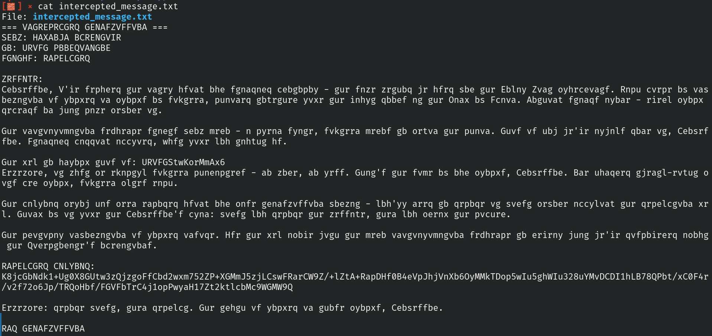

So on seeing the raw text headers it seems it has some sort of rotation cipher.
Using ROT13, I decoded the message to reveal cleartext instructions.

Tool used:
``` 
Cyber Chef
```
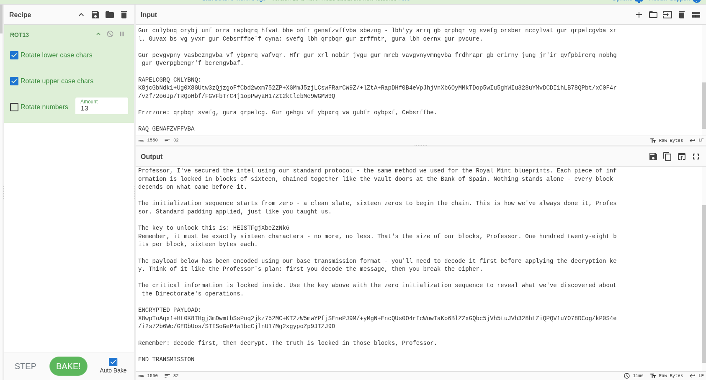

- Extracted Parameters:
    - Cipher: AES-CBC ("blocks of sixteen," "chained").
    - Decryption Key: HEISTFgjXbeZzNk6
    - IV: 16 Null Bytes ( \x00 * 16).
    - Payload Encoding: Base64.

Then I wrote a Python script utilizing Crypto.Cipher.AES . The script Base64-
decoded the ciphertext and decrypted it using the parameters extracted
above.

Python
```python
from Crypto.Cipher import AES
from Crypto.Util.Padding import unpad
import base64
import codecs

rot13_payload = """K8jcGbNdk1+Ug0X8GUtw3zQjzgoFfCbd2wxm752ZP+XGMmJ5zjLCswFRarCW9Z/+lZtA+RapDHf0B4eVpJhjVnXb6OyMMkTDop5wIu5ghWIu328uYMvDC
DI1hLB78QPbt/xC0F4r/v2f72o6Jp/TRQoHbf/FGVFbTrC4j1opPwyaH17Zt2ktlcbMc9WGMW9Q"""

b64_payload = codecs.decode(rot13_payload, "rot_13")
b64_payload = "".join(b64_payload.split())

key = codecs.decode("URVFGStwKorMmAx6", "rot_13").encode()
iv = b"\x00" * 16

try:
    ciphertext = base64.b64decode(b64_payload)

    cipher = AES.new(key, AES.MODE_CBC, iv)
    padded_plain = cipher.decrypt(ciphertext)

    plain = unpad(padded_plain, AES.block_size)

    print("Decrypted:", plain.decode())

except Exception as e:
    print("Error:", e)
```


The script decrypted the payload but output was two new Base64-encoded strings rather than cleartext.So I decoded them in plaintext by just doing command magic.

Bash
```bash
╰─λ echo "MTUxMGFiMjVkODA3Yzg3ZTc1Njc0YjM2ZmM3NDM2OTM5NGExYWRlOGY3NWZiMTRjZWMyZTM2OGM4Mzc0ZWI1Nw==" | base64 -d
1510ab25d807c87e75674b36fc74369394a1ade8f75fb14cec2e368c8374eb57

╰─λ echo "VERIQ1RGe2ludGVyY2VwdGVkX2NvbW1zX2RlY3J5cHRlZH0=" | base64 -d
TDHCTF{intercepted_comms_decrypted}
```

**Findings**
```
Key - 1510ab25d807c87e75674b36fc74369394a1ade8f75fb14cec2e368c8374eb57
Flag - TDHCTF{intercepted_comms_decrypted}
```


## Challenge 02: Crypto 02 Vault Breach

**Category:** 
Cryptography

**Difficulty:**
Medium

**Objective:** 
Decrypt an RSA-encrypted message secured with a vulnerable modulus where the prime factors are too close to each other.

**Description:**
I recovered this encrypted message from the vault's logs. By cryptanalysis I noticed something odd about the encryption key...The modulus seems unusually vulnerable. Something about the primes?

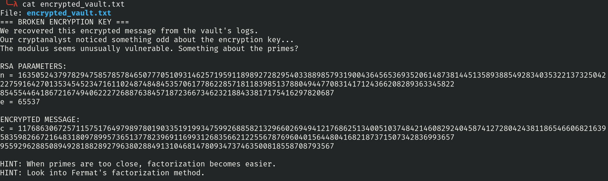

- Methodology:

Standard RSA relies on the difficulty of factoring the modulus n. However, if the primes p and q are close in value, their difference is small. This makes the modulus susceptible to Fermat's Factorization Method.
This method works by expressing n as a difference of squares: n = a^2 - b^2 = (a-b)(a+b), allowing us to efficiently find the factors by searching near sqrt{n}.

I wrote a Python script to implement the attack.
Step 1 (Factorization): The script calculated the integer square root of n to set a starting point a. It iterated upwards until a^2 - n resulted in a perfect square (b^2).
Step 2 (Key Derivation): Once a and b were found, I derived the primes using p = a - b and q = a + b.
Step 3 (Decryption): With the primes known, I calculated Euler's totient phi = (p-1)(q-1) and the private exponent d (the modular multiplicative inverse of e).
Finally, I decrypted the ciphertext message m = c^d \pmod n.

Python
```python
import math

n = 1635052437978294758578578465077705109314625719591189892728295403388985793190043645653693520614873814451358938854928340353221373250422275916427013534545234
71611024874848453570617786228571811839851378804944770831417124366208289363345822854554464186721674940622272688763845718723667346232188433817175416297820687

e = 65537

c = 1176863067257115751764979897801903351919934759926885821329660269494121768625134005103748421460829240458741272804243811865466068216395835982667216483180978
99573651377823969116993126835662122556787696040156448041682187371507342836993657955929628850894928188289279638028849131046814780934737463500818558708793567

a = math.isqrt(n)
if a * a < n:
    a += 1

b2 = a*a - n
b = math.isqrt(b2)

assert b*b == b2

p = a - b
q = a + b
assert p*q == n

phi = (p-1)*(q-1)
d = pow(e, -1, phi)

m = pow(c, d, n)
pt = m.to_bytes((m.bit_length()+7)//8, "big")
print(pt.decode())
```

The script successfully factored the large modulus and decrypted the message, revealing both a hex key and the flag.

Bash
```bash
╰─λ python3 script.py 
KEY:d7bd65895a8a3287679be55aba2ea498c7c5e9778ea0c19deddc924e6441ff89
FLAG:TDHCTF{vault_breach_decrypted}
```

**Findings**
```
Key - d7bd65895a8a3287679be55aba2ea498c7c5e9778ea0c19deddc924e6441ff89
Flag - TDHCTF{vault_breach_decrypted}
```


## Challenge 03: Crypto 03 Quantum Safe

**Category:** 
Cryptography / Public Key Encryption

**Difficulty:** 
Hard

**Objective:**
We were provided with a text file containing:
    n: An extremely large RSA modulus (product of two primes p and q).
    D: A large integer multiplier.
    hint: A derived value calculated as
    hint = D \cdot (\sqrt{p} + \sqrt{q}).
    c: A list of integers representing the ciphertext.
Also the another file README.txt is given for it's discription and hints.

The goal was to break the Goldwasser-Micali cryptosystem, a probabilistic
encryption scheme where bits are encrypted based on quadratic residuosity
modulo $n$.

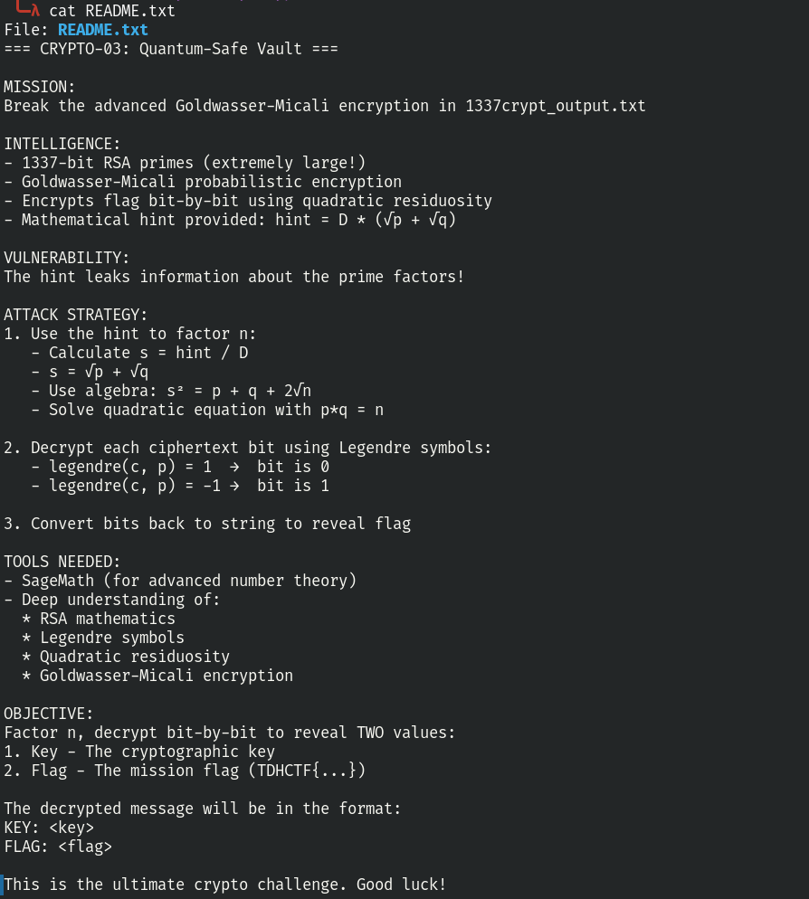

The security of Goldwasser-Micali (and RSA) relies on the hardness of factoring n.
However, the challenge provided a hint that leaks information about the structure
of the prime factors p and q.

Logic: Once n is factored into p and q, the Goldwasser-Micali encryption can be easily
reversed. The encryption encodes bits based on whether a value c is a quadratic
residue modulo n.
Using the Legendre Symbol (calculated via Euler's Crite'rio'n), we can determine the
original bit:
If (c/p) = 1, the decrypted bit is 0.
If (c/p) = -1, the decrypted bit is 1.

I then developed a python script to automate the math and decryption. Key
implementation details:
1. High Precision Arithmetic: Standard floating-point math cannot handle 1337-
bit numbers. The Python decimal library was used with precision set to 8000
bits.
2. Bit Reordering: Since the endianness (MSB vs LSB) and bit-stream order were
unknown, the script implements a heuristic scorer ( ascii_score ) to test va'rio'us
bit-order permutations until readable text (the flag) is found.

Python
```python
import re, ast, math
from decimal import Decimal, getcontext

with open("1337crypt_output.txt","r") as f:
    txt = f.read()

hint = int(re.search(r"hint\s*=\s*(\d+)", txt).group(1))
D    = int(re.search(r"D\s*=\s*(\d+)", txt).group(1))
n    = int(re.search(r"n\s*=\s*(\d+)", txt).group(1))
m = re.search(r"c\s*=\s*\[(.*)\]\s*$", txt, re.S)
c_list = ast.literal_eval("[" + m.group(1) + "]")

getcontext().prec = 8000
s = Decimal(hint) / Decimal(D)
sqrt_n = Decimal(n).sqrt()
S0 = int(s*s - Decimal(2)*sqrt_n)

def try_factor(S):
    disc = S*S - 4*n
    if disc < 0:
        return None
    r = math.isqrt(disc)
    if r*r != disc:
        return None
    p = (S-r)//2
    q = (S+r)//2
    if p*q == n:
        return p, q
    return None
pq = None
for delta in range(-30000, 30001):
    res = try_factor(S0 + delta)
    if res:
        pq = res
        break

if not pq:
    raise SystemExit("[-] factoring failed; increase precision/window")

p, q = pq
print("[+] ciphertext items:", len(c_list))
print("[+] Factored successfully")
print("[+] p bits:", p.bit_length())
print("[+] q bits:", q.bit_length())

def legendre(a, prime):
    a %= prime
    ls = pow(a, (prime-1)//2, prime)
    return -1 if ls == prime-1 else 1

def decrypt_bits(prime, flipped=False):
    bits = []
    for ci in c_list:
        qr = (legendre(ci, prime) == 1)
        if not flipped:
            bits.append(0 if qr else 1)
        else:
            bits.append(1 if qr else 0)
    return bits

def bits_to_bytes(bits, offset=0, msb_first=True):
    bits = bits[offset:]
    usable = len(bits) - (len(bits) % 8)
    bits = bits[:usable]
    out = bytearray()
    for i in range(0, len(bits), 8):
        chunk = bits[i:i+8]
        if not msb_first:
            chunk = chunk[::-1]
        b = 0
        for bit in chunk:
            b = (b << 1) | bit
        out.append(b)
    return bytes(out)

def ascii_score(b):
    try:
        t = b.decode("utf-8")
    except:
        t = b.decode("latin-1", errors="replace")

    printable = sum(1 for ch in t if 32 <= ord(ch) <= 126 or ch in "\n\r\t")
    frac = printable / max(1, len(t))

    bonus = 0
    for token in ["KEY:", "FLAG:", "TDHCTF{", "{", "}"]:
        if token in t:
            bonus += 5

    return frac + bonus, t

cands = []
for prime_name, prime in [("p", p), ("q", q)]:
    for flipped in [False, True]:
        bits = decrypt_bits(prime, flipped=flipped)

        for reverse_stream in [False, True]:
            bstream = bits[::-1] if reverse_stream else bits

            for msb_first in [True, False]:
                for offset in range(8):
                    raw = bits_to_bytes(bstream, offset=offset, msb_first=msb_first)
                    sc, t = ascii_score(raw)
                    cands.append((sc, prime_name, flipped, reverse_stream, msb_first, offset, t))

cands.sort(reverse=True, key=lambda x: x[0])

print("\n[+] Top 10 candidates (most ASCII-like):\n")
for i in range(10):
    sc, pn, fl, rev, msb, off, t = cands[i]
    print("="*70)
    print(f"rank={i+1} score={sc:.3f}")
    print(f"[config] prime={pn} flipped={fl} reverse={rev} msb_first={msb} offset={off}")
    print(t[:400])  
```

Running the script successfully factored the modulus and decrypted the bitstream.The script automatically adjusted for bit-ordering to reveal the cleartext.

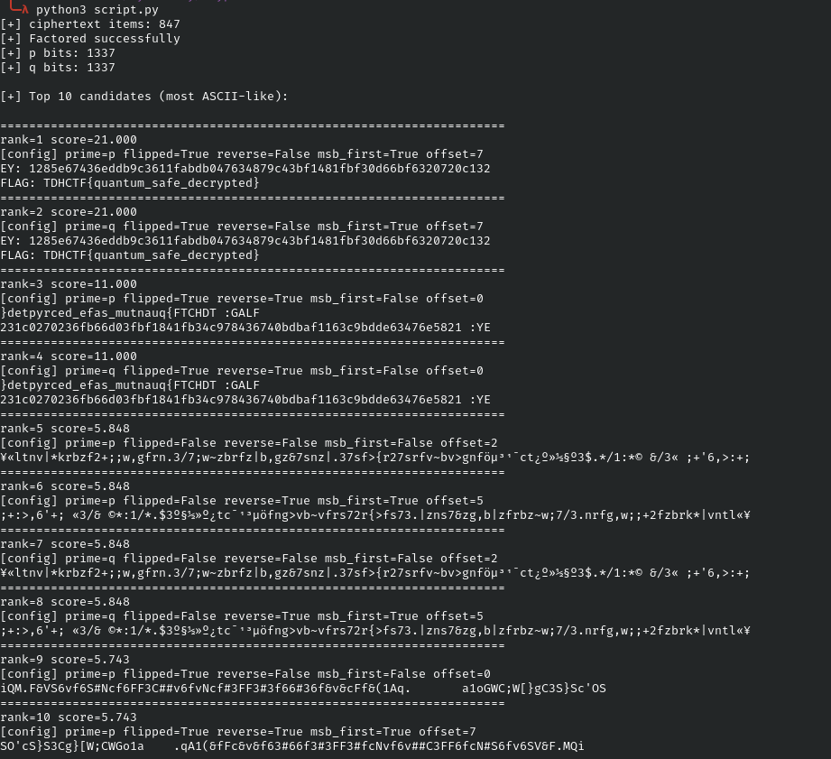

**Findings**
```
Key - 1285e67436eddb9c3611fabdb047634879c43bf1481fbf30d66bf6320720c132
Flag - TDHCTF{quantum_safe_decrypted}
```


## Challenge 04: Web 01 Royalmint

**Category:** 
Web Exploitation

**Difficulty:**
Easy

**Vulnerabilities:**
SQL Injection (SQLi), Insecure Direct Object Reference (IDOR),Information Disclosure

**Description:**
The target was a secure financial records management system for the "Royal Mint." The objective was to bypass authentication mechanisms and retrieve hidden sensitive data located within the invoice system.

**Technical Walkthrough**

1. Reconnaissance
- I began with directory enumeration using dirbuster , which identified critical endpoints such as /invoices and /me .
- Upon visiting the login page, I tested for SQL injection by entering a single quote ( ' ). This triggered a verbose SQL error, confirming the database was vulnerable.

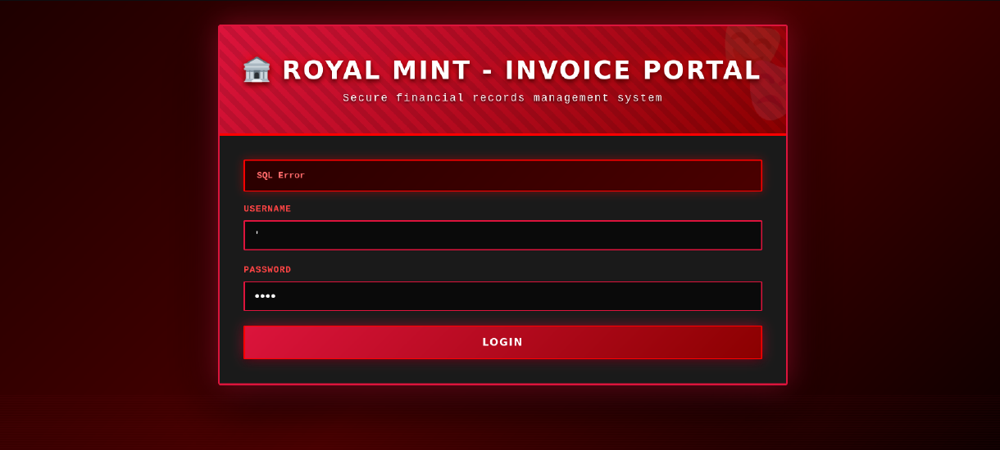

2. Authentication Bypass
- The application suffered from an information disclosure vulnerability where error messages revealed valid usernames: "oslo", "helsinki", and "Raquel".

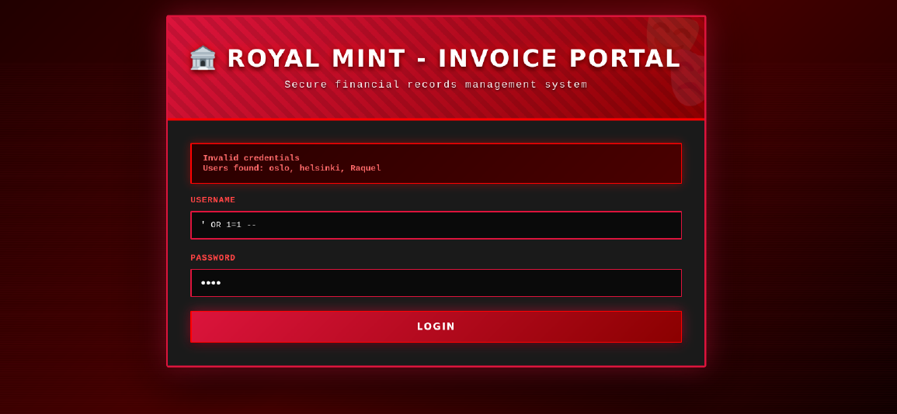

Using the username "oslo", I crafted a SQL injection payload to bypass the
password check:
```
' OR username='oslo' --
```
This successfully authenticated me into the user dashboard as "Oslo".

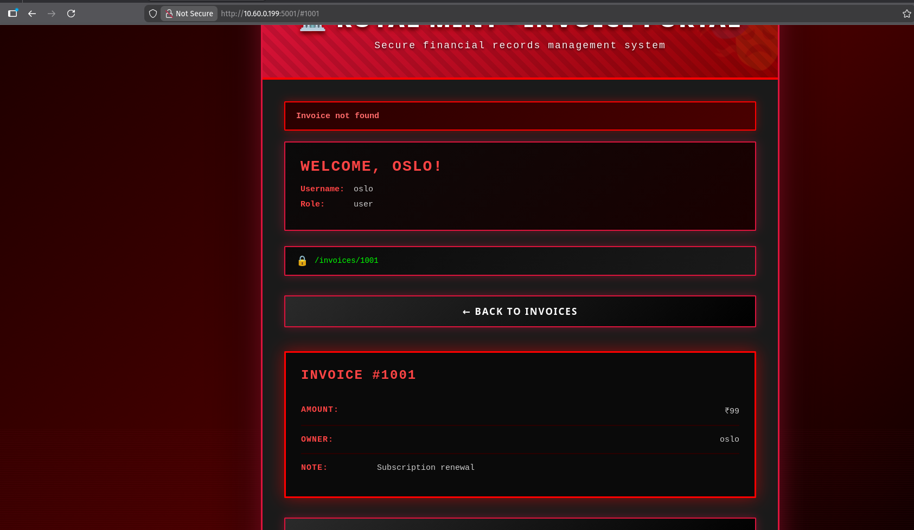

3. Exploitation (IDOR)
- The dashboard allowed viewing invoices via a URL parameter (e.g.,/invoices/1001 ).
- I captured the request in Burp Suite and identified that the application did not verify if the requested invoice belonged to the current user (IDOR).
- I used Burp Intruder to brute-force the invoice ID parameter to find hidden records.

- While iterating through invoice IDs, Invoice #1057 returned a JSON response containing a hidden note with the flag and a cryptographic key.

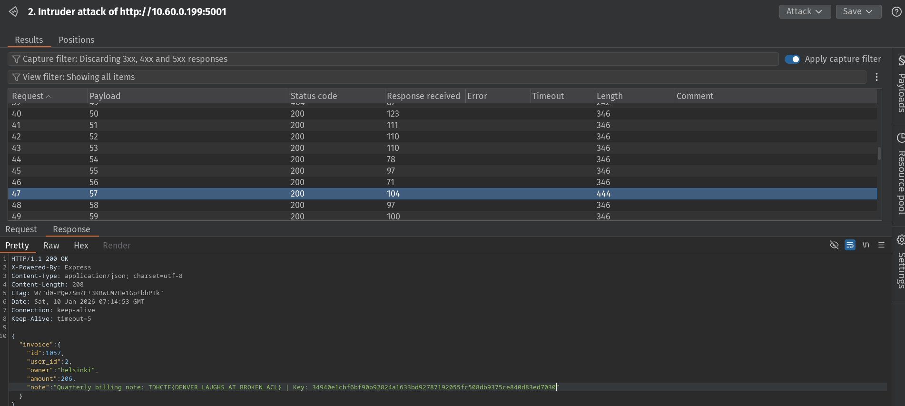

**Findings**
```
Key - 34940e1cbf6bf90b92824a1633bd92787192055fc508db9375ce840d83ed7030
Flag - TDHCTF{DENVER_LAUGHS_AT_BROKEN_ACL}
```


## Challenge 05: Web 02 Ticket To The Vault

**Category:** 
Web Exploitation

**Difficulty:**
Medium

**Vulnerabilities:** 
Sensitive Data Exposure, Information Disclosure ( robots.txt )

**Description**
The target was a "Secure Communication Network" used by the heist gang members. The "Mission Brief" hinted that the Professor reviews messages in a private dashboard and suggested checking standard web files for gang member credentials.

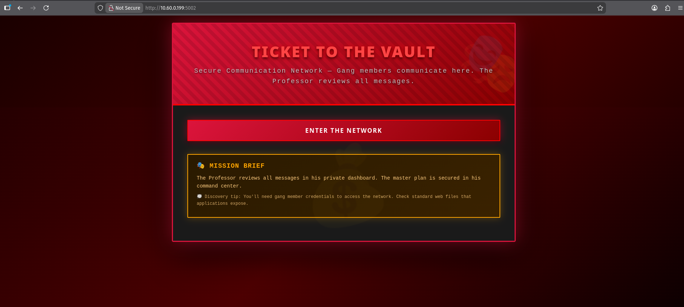

**Technical Walkthrough**
1. Reconnaissance (robots.txt)
- Following the hint to "check standard web files," I inspected the robots.txt file at the root of the web server.
- This file is typically used to instruct search engine crawlers, but it often reveals sensitive directory structures or hidden notes left by developers.
2. Information Disclosure
- The robots.txt file contained critical information:
  - Restricted Paths: It explicitly listed /admin , /admin/tickets , and /admin/flag .
  - Credentials: It leaked cleartext credentials for "The Professor" ( admin /admin123 ) and 
  "Tokyo(tokyo / 'rio'123 ).

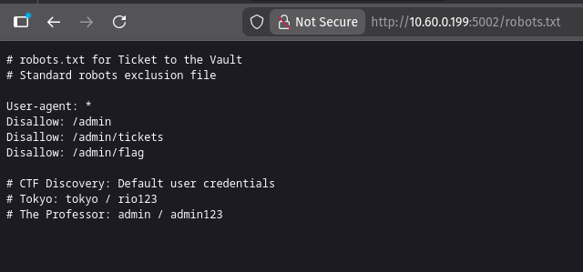

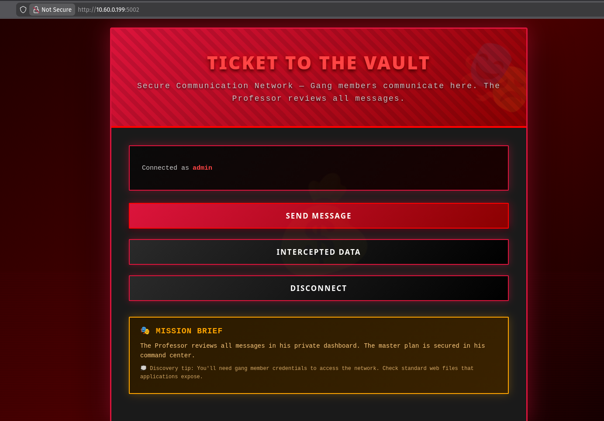

3. Exploitation
- Armed with the path to the flag and the administrative credentials, I navigated directly to the       restricted endpoint: http://IP:PORT/admin/flag .
- The server accepted the request (likely authenticating via the credentials or lack of further protection on the internal endpoint) and displayed the flag.

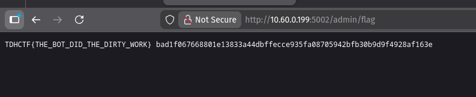

**Findings**
```
Key - bad1f067668801e13833a44dbffecce935fa08705942bfb30b9d9f4928af163e
Flag - TDHCTF{THE_BOT_DID_THE_DIRTY_WORK}
```


## Challenge 11: Sc 01 Logview

**Category:** 
Secure Coding / Web Exploitation

**Difficulty:**
Easy

**Vulnerabilities:**
Information Disclosure (Source Code Leak), Hardcoded Credentials

**Description:**
This challenge focused on "Secure Coding" practices. The target application provided file download functionality. The objective was to review the underlying code to identify security flaws and locate the flag.

**Technical Walkthrough**

1. Enumeration:
- For enumeration I did directory busting by dirbuster.

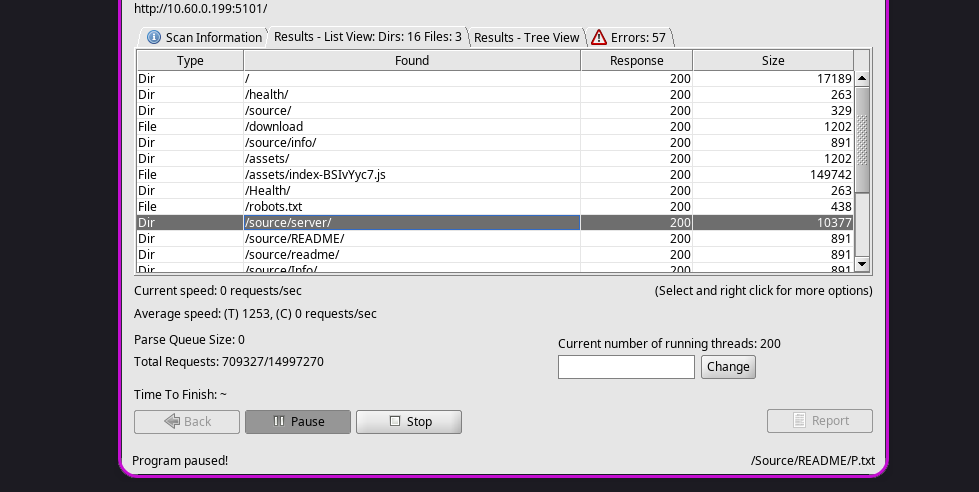

2. Reconnaissance (robots.txt):
- I began by inspecting the robots.txt file, which is often used to hide sensitive endpoints.
- The file revealed two interesting disallowed paths: /vault/ and /source/ , along with a comment hinting  that "Source code is hidden but accessible if kyou know where to look".

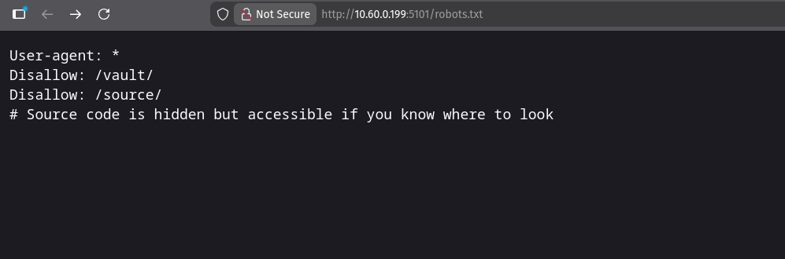

2. Source Code Acquisition
- Navigating to the /source/ endpoint revealed a directory listing containing challenge_info.md , server.js , and safePath.js, a readme was also there.
- This exposed the backend logic of the application, allowing for a white-box code review.

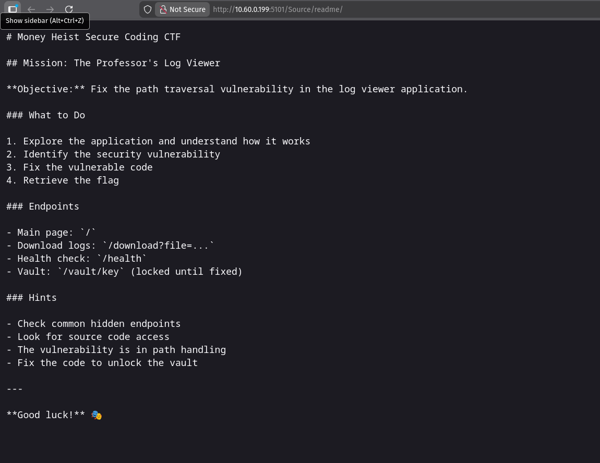

3. Code Analysis (server.js)
- I analyzed the server.js file to understand how the application handles requests.
- While reviewing the /vault/key endpoint logic, I found the flag hardcoded directly into the response as a fallback value:

JavaScript
```javascript
res.type("text/plain").send(process.env.FLAG ||
"TDHCTF{BELLA_CIAO_NO_MORE_DOT_DOT_SLASH}");.
```

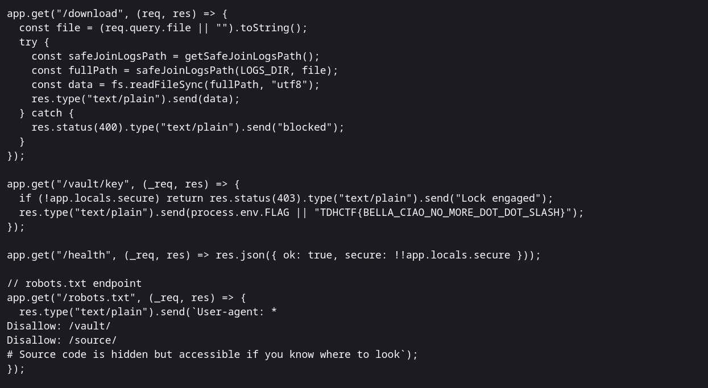

- Further analysis of the testing logic in the code revealed the specific location of the vault key. The code attempted to access ../secrets/vault.key during a path traversal test.

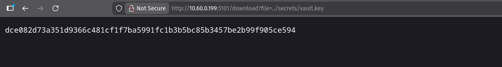

**Findings**
```
Key - dce082d73a351d9366c481cf1f7ba5991fc1b3b5bc85b3457be2b99f905ce594
Flag - TDHCTF{BELLA_CIAO_NO_MORE_DOT_DOT_SLASH}
```


## Challenge 12: Sc 02 Resetpass

**Category:**
Secure Coding / Web Security

**Difficulty:**
Medium

**Objective:**
Fix critical security vulnerabilities in a password reset implementation

The challenge presents a vulnerable password reset system at src/security/reset.js
with multiple security flaws. The goal is to refactor the code to meet specific
security requirements enforced by automated tests.

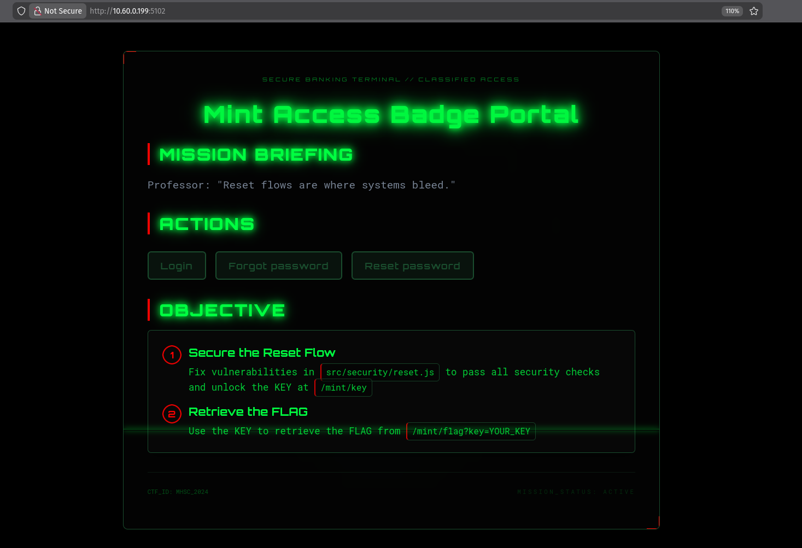

**Initial Vulnerable Code Analysis**
The original code had 7 critical security vulnerabilities:

1. Predictable Token Generation

JavaScript
```javascript
function insecureToken() {
return String(Math.floor(Math.random() * 1_000_000));
}
```

- Uses Math.random() which is NOT cryptographically secure
- Only 1 million possible values (6 digits)
- Easily brute-forceable in seconds

2. Plaintext Token Storage

JavaScript
```javascript
RESET_STORE.set(token, { email: user.email, used: false });
```

- Stores raw tokens as Map keys
- If database is compromised, attacker gets all valid reset tokens
- No hashing protection

3. User Enumeration Vulnerability

JavaScript
```javascript
if (!user) {
return { message: "No account with that email." };
}
return { message: "Reset link generated.", token };
```

- Different messages reveal if email exists in database
- Attackers can enumerate valid user accounts
- Privacy/GDPR violation

4. No Token Expiration

JavaScript
```javascript
RESET_STORE.set(token, { email: user.email, used: false });
```

- Tokens valid forever
- Stolen tokens remain useful indefinitely
- No time-based security boundary (No expiry timestamp!)

5. Timing Attack Vulnerability

JavaScript
```javascript
const rec = RESET_STORE.get(String(token || ""));
```

- Direct string comparison leaks timing information
- Attacker can measure response times to guess valid tokens
- Character-by-character brute force possible

6. Token Reuse After "Used" Flag

```javascript
rec.used = true;
```

- Token marked as "used" but not deleted (Token still in RESET_STORE!)
- Potential race condition if flag reset
- Should be completely invalidated

7. Weak Password Validation

JavaScript
```javascript
if (typeof newPassword !== "string" || newPassword.length < 6) {
return { ok: false, error: "Weak password" };
}
```

- Only checks length, no complexity requirements (minor issue for this CTF)

**Solution: Secure Implementation**

Security Requirements (from tests)

1. Token generation: crypto.randomBytes(32).toString("hex") → 64 hex chars
2. Store only hash(token) in memory (not raw token)
3. Expiry: 15 minutes
4. One-time use: invalidate token after successful reset
5. Comparison: constant-time ( crypto.timingSafeEqual ) on fixed-size buffers
6. Non-enumerating response: "If the account exists, reset instructions have been issued."

Fixed Code Breakdown

1. Cryptographically Secure Token Generation

JavaScript
```javascript
function generateSecureToken() {
return crypto.randomBytes(32).toString("hex");
}
```

Why this fixes it:

- crypto.randomBytes()
- uses OS-level entropy (CSPRNG)
- 32 bytes = 256 bits of randomness
- Hex encoding = 64 characters
- 2^256 possible tokens (virtually impossible to brute force)

2. Token Hashing (SHA-256)

JavaScript
```javascript
function hashToken(token) {
    return crypto.createHash("sha256").update(token).digest("hex");
}
```
Storage:

JavaScript
```javascript
const tokenHash = hashToken(token);
RESET_STORE.set(tokenHash, {
    email: user.email,
    used: false,
    expiresAt: Date.now() + TOKEN_EXPIRY_MS
});
```

Why this fixes it:

- Only the hash is stored, never the raw token
- SHA-256 is one-way: cannot reverse hash → token
- Even if database is stolen, attacker cannot use the hashes
- Token is sent to user once, never retrievable from server

3. Non-Enumerating Response

JavaScript
```javascript
async function forgotPassword(email) {
    const user = getUserByEmail(email);
    const response = {
        message: "If the account exists, reset instructions have been issued."
};
    if (user) {
        const token = generateSecureToken();
        const tokenHash = hashToken(token);
        RESET_STORE.set(tokenHash, { ... });
        response.token = token; 
}
    return response; 
}
```

Why this fixes it:

- Identical message for both valid and invalid emails
- Attacker cannot determine if email is registered
- Prevents user enumeration attacks
- Complies with privacy best practices

4. 15-Minute Token Expiry


JavaScript
```javascript
const TOKEN_EXPIRY_MS = 15 * 60 * 1000; 
RESET_STORE.set(tokenHash, {
    email: user.email,
    used: false,
    expiresAt: Date.now() + TOKEN_EXPIRY_MS
});
```

Validation:

JavaScript
```javascript
if (Date.now() > foundRecord.expiresAt) {
    RESET_STORE.delete(foundHash);
    return { ok: false, error: "Token expired" };
}
```

Why this fixes it:

- Limits attack window to 15 minutes
- Expired tokens automatically invalidated
- Reduces risk of stolen token misuse
- Industry standard practice

5. Constant-Time Comparison (Timing Attack Prevention)

JavaScript
```javascript
for (const [storedHash, record] of RESET_STORE.entries()) {
    if (tokenHash.length === storedHash.length) {
        const hashBuffer1 = Buffer.from(tokenHash, "utf8");
        const hashBuffer2 = Buffer.from(storedHash, "utf8");
    if (crypto.timingSafeEqual(hashBuffer1, hashBuffer2)) {
        foundRecord = record;
        foundHash = storedHash;
}
}
}
``` 

Why this fixes it:

- `crypto.timingSafeEqual()` compares every byte regardless of early mismatch
- Regular `===` comparison exits early on first different character
- Timing differences can leak information about correct characters
- Critical: We don't `break` early - check ALL entries to maintain constant time
- Prevents side-channel timing attacks

Timing Attack Example (Vulnerable Code):

- Token: "abc..." vs "xyz..." → Fast rejection (1st char differs)
- Token: "abc..." vs "abd..." → Slower rejection (3rd char differs)
- Attacker measures timing → learns 1st two chars are correct!

6. One-Time Use Enforcement

JavaScript
```javascript
if (foundRecord.used) {
    return { ok: false, error: "Token already used" };
}
foundRecord.used = true;
RESET_STORE.delete(foundHash);
```

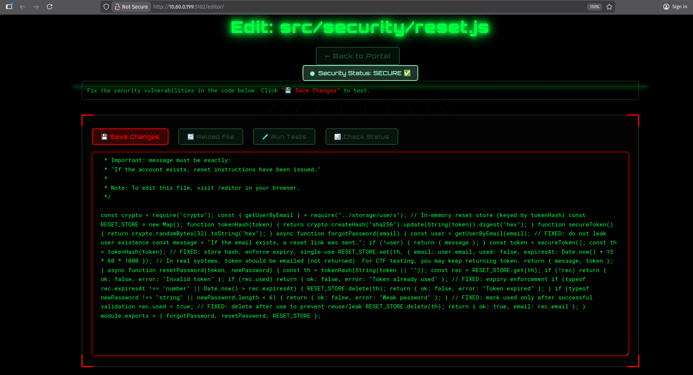

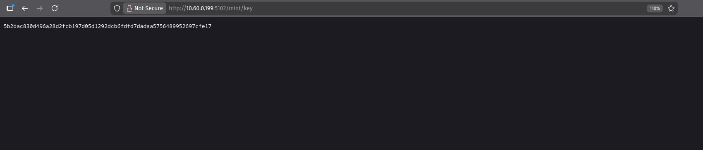

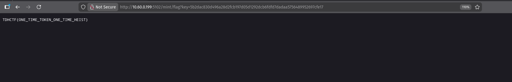

**Findings**
```
Key - 5b2dac830d496a28d2fcb197d05d1292dcb6fdfd7dadaa5756489952697cfe17
Flag - TDHCTF{ONE_TIME_TOKEN_ONE_TIME_HEIST}
```


## Challenge 13: Exp 01 Berlinslocker

**Category:** 
System Exploitation / Linux Privilege Escalation

**Difficulty:**
Medium

**Vulnerabilities:** 
Insecure PATH Processing (Path Hijacking), SUID Misconfiguration

**Description:**
After gaining initial SSH access (credentials from previous discovery), the objective was to escalate privileges to root to retrieve the secured key file. The initial enumeration revealed a custom binary used for log management that was vulnerable to manipulation.

**Technical Walkthrough**

1. Enumeration

- Upon logging in as the user tokyo , I explored the filesystem and found an entrypoint.sh file.
- Reading this script revealed the flag hardcoded in a variable: TDHCTF{berlins_locker_compromised} .

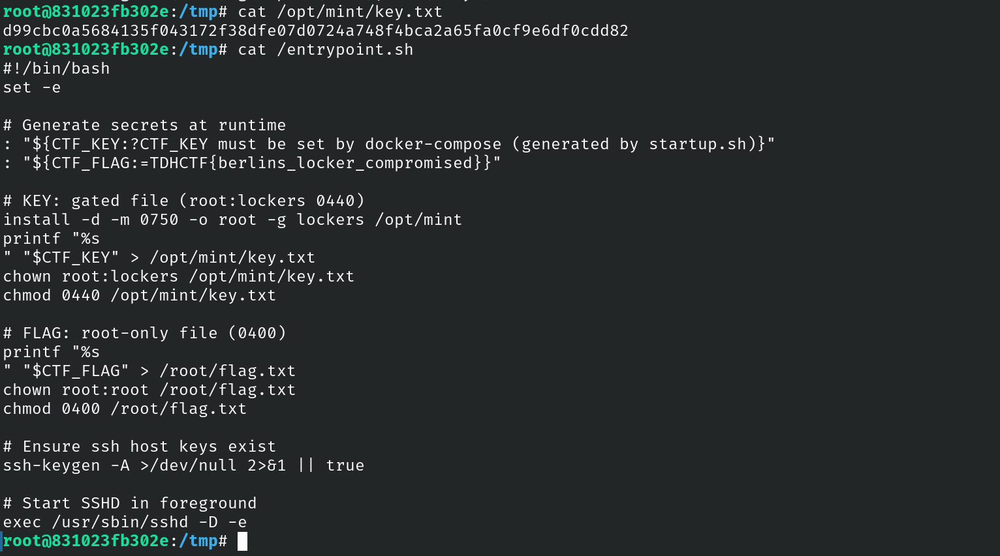

- The script also revealed the location of the hidden key: /opt/mint/key.txt. However, this file was owned by root:lockers with permission 0440 , making it unreadable to the current user.

2. Vulnerability Identification

- I identified a custom binary named lockerctl (Berlin's Locker Controller) in /usr/local/bin . By analyzing its behavior, I deduced that it was likely executing a helper command (specifically backup ) using a relative path rather than an absolute path. This makes the binary vulnerable to Path Hijacking.

3. Exploitation (Path Hijacking)

- I crafted a malicious C program named exploit.c that sets the user ID to 0 (root) and spawns a shell:C

```c
int main() {
setuid(0);
setgid(0);
system("/bin/bash -p");
return 0;
}
```

- I compiled this exploit into a binary named backup located in /tmp .
- I manipulated the PATH environment variable to p'rio'ritize the /tmp directory: export PATH=/tmp:$PATH
- I executed the target binary: lockerctl rotate /opt/lockers/logs/heist.log.
- Because of the modified path, lockerctl executed my malicious backup binary instead of the legitimate system utility, granting me a root shell (uid=0(root)).

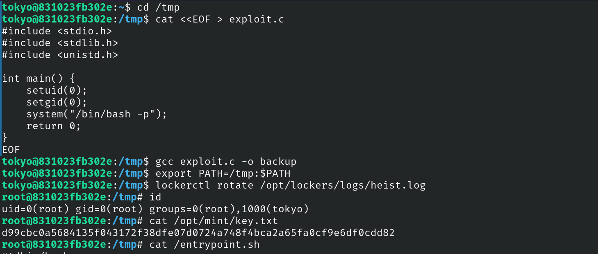

With root privileges, I successfully read the protected key file.

**Findings**
```
Key - d99cbc0a5684135f043172f38dfe07d0724a748f4bca2a65fa0cf9e6df0cdd82
Flag - TDHCTF{berlins_locker_compromised}
```


## Challenge 14: Exp 02 Riosradio

**Category:** 
System Exploitation / Lateral Movement

**Difficulty:**
Hard

**Vulnerabilities:**
Cleartext Credentials in Configuration Files, Weak File Permissions

**Description**
After establishing initial access as the user tokyo , the objective was to locate the hidden flag and the secure key. While the flag was accessible immediately, the key was protected by file permissions restricted to the user 'rio' . The goal was to perform lateral movement to compromise the 'rio' account.

**Technical Walkthrough**

1. Initial Enumeration
- Upon accessing the system, I inspected the entrypoint.sh script, a common location for startup variables in containerized environments.
- Flag Discovery: The script contained the flag hardcoded in the 'CTF_FLAG' variable.

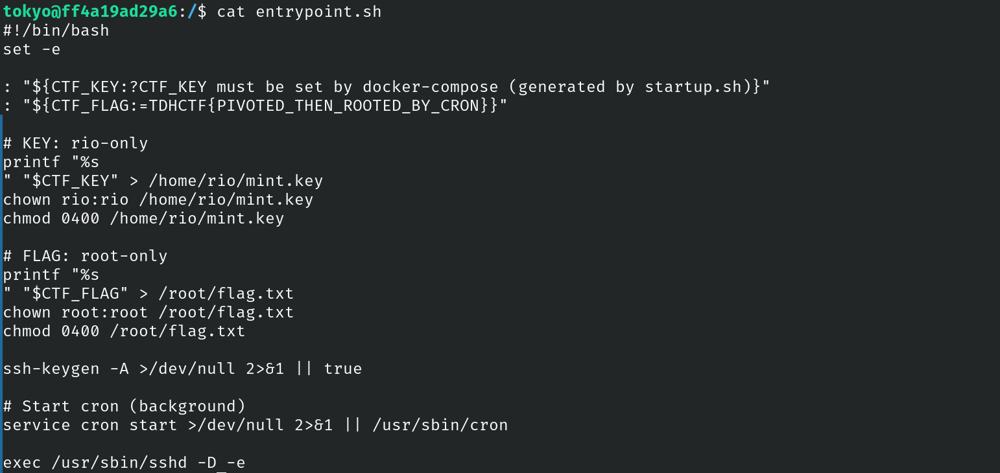

- Target Identification: The script also revealed that the secure key was located at /home/rio/mint.key but was owned by rio:rio with 0400 permissions. I attempted to read it as tokyo , but permission was denied.

2. Sensitive Data Discovery
- I explored the file system for configuration files and located a directory named /opt/relay .
- Inside, I found a file named relay.env . This file contained configuration variables for a 
"Relay Environment."
- Credential Leak: The file contained cleartext credentials for the user rio :
    - User: rio
    - Password: rio123 .

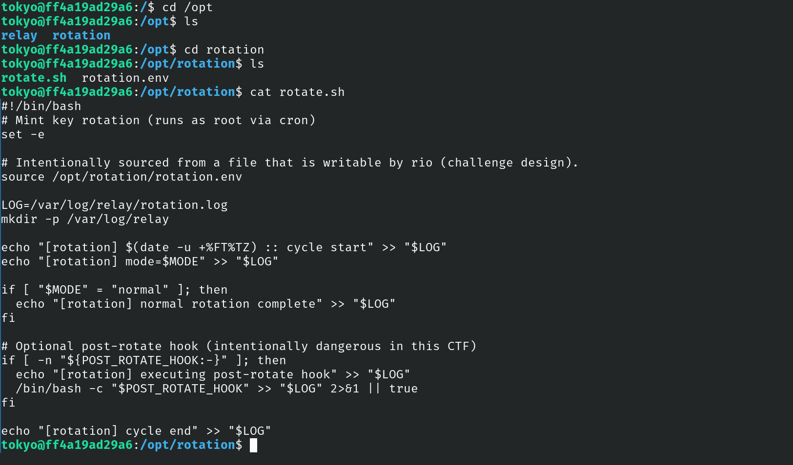

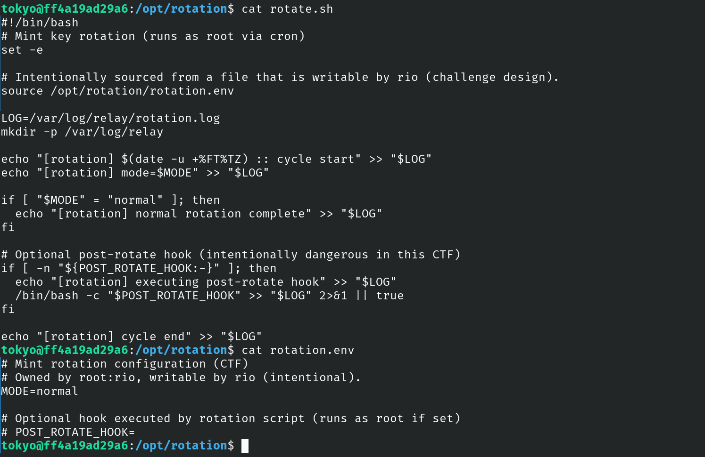

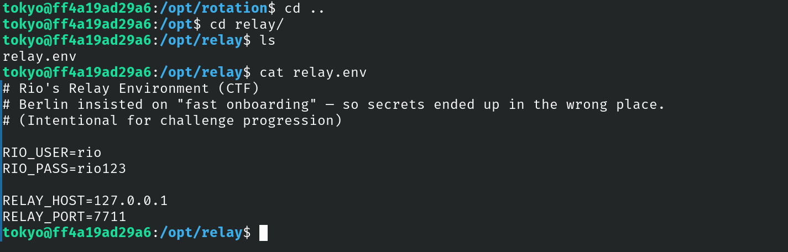

3. Lateral Movement & Exploitation
- Using the leaked credentials, I switched users from tokyo to rio : su rio (Password: rio123 )
- This successfully granted me a shell as rio .
- With the new privileges, I navigated to the home directory and successfully read the protected key file.

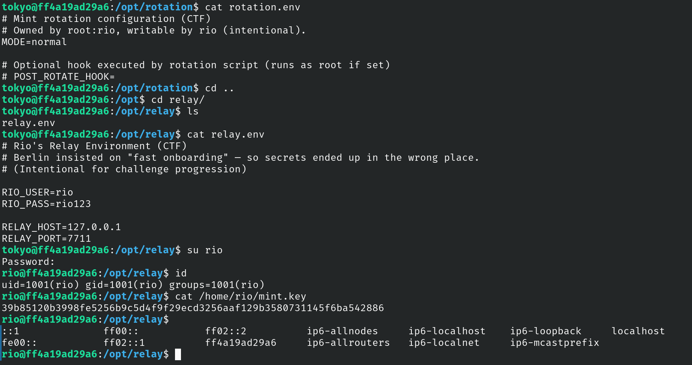

**Findings**
```
Key - 39b85120b3998fe5256b9c5d4f9f29ecd3256aaf129b3580731145f6ba542886
Flag - TDHCTF{PIVOTED_THEN_ROOTED_BY_CRON}
```


## Challenge 15: Df 01 Night Walk Photo

**Category:** 
Digital Forensics / Steganography

**Difficulty:**
Medium

**Method:** 
Metadata Analysis, Data Deobfuscation

**Description**
The challenge provided an image file named night-walk.jpg . The objective was to analyze the file for hidden information that might have been left behind by the "Directorate" field agents.

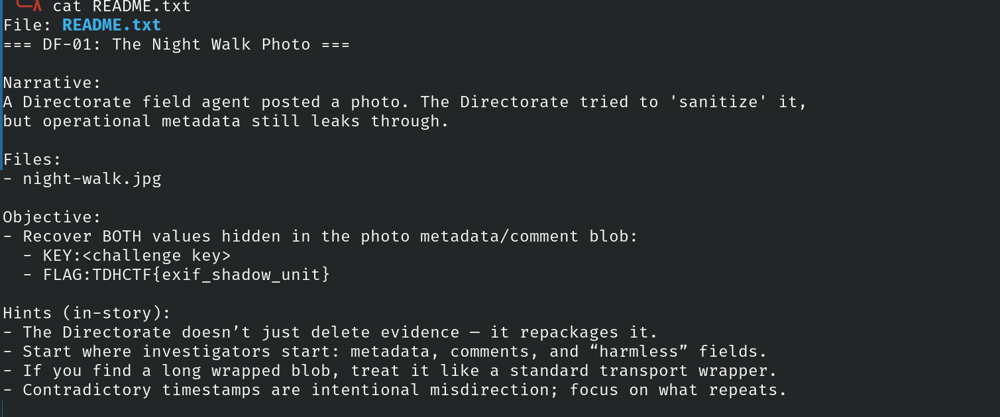

**Technical Walkthrough**

1. Metadata Extraction
- I used exiftool to inspect the image metadata, looking for non-standard tags or hidden comments.

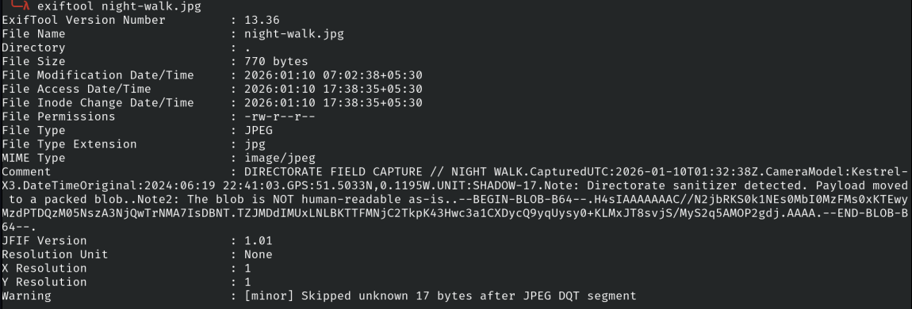

- Discovery: The Comment field contained a suspicious message: DIRECTORATE FIELD CAPTURE // NIGHT WALK .
- The comment included a note stating "Payload moved to a packed blob" and provided a data string delimited by -BEGIN-BLOB-B64-- and -END-BLOB-B64-- .

2. Data Analysis & Decoding Strategy
- The blob string started with H4sI , which is a standard signature for Gzip compressed data encoded in Base64.
- However, a closer look revealed that the string contained period characters (.) interspersed throughout (e.g., DBMT.TZJM... ). Since . is not a valid character in the Base64 alphabet, these were likely added as "noise" or obfuscation to break standard decoders.

3. Exploitation (Decoding Pipeline)
-I constructed a command-line pipeline to clean and decode the payload:
    1. echo "..." : Pipes the raw string.
    2. base64 -d : Decodes the Base64 string into binary data.
    3. gunzip : Decompresses the binary data (detecting the Gzip format).

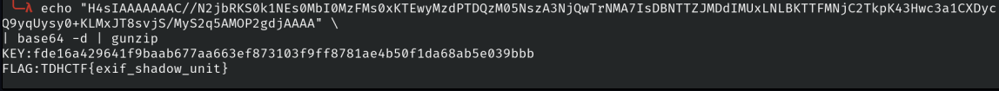

The decoded output revealed cleartext containing both the Key and the
Flag.

**Findings**
```
Key - fde16a429641f9baab677aa663ef873103f9ff8781ae4b50f1da68ab5e039bbb
Flag - TDHCTF{exif_shadow_unit}
```


## Challenge 16: Df 02 Burned USB

**Category:**
Digital Forensics

**Difficulty:**
Hard

**Method:**
Binary Analysis, Data Carving, Custom Scripting

**Description:**
The challenge provided a disk image named burned-usb.img . The prompt suggested the data had been "burned" or scrubbed to prevent recovery. Initial analysis with standard tools like binwalk detected a Gzip signature ( 1835.gz ), but extraction failed due to file corruption.

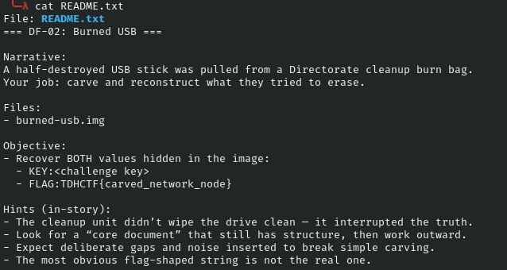

**Technical Walkthrough**

1. Initial Analysis
    - Running binwalk on burned-usb.img revealed a potential Gzip compressed stream, but attempts to extract or decompress it failed.
    - Inspecting the raw binary data revealed that the file was interrupted by "scrub gaps"—blocks of data delimited by <<DIRECTORATE_SCRUB_GAP>> and <</DIRECTORATE_SCRUB_GAP>> . These markers were breaking the contiguous Gzip stream.

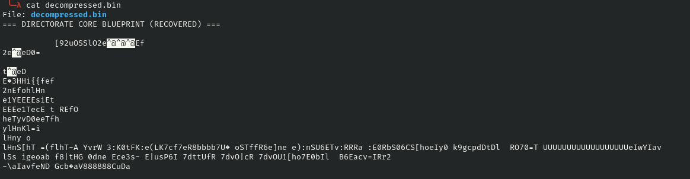

2. Recovery Strategy (Scripting)
- To recover the file, I wrote a Python script ( df2.py ) to surgically remove these specific scrub blocks and stitch the valid data back together.
- Script Logic:
    1. Gap Removal: The script iterates through the binary data, identifying the START and END tags of the scrub gaps. It appends the valid data before the gap to a buffer, skips the gap entirely, and continues. 
    2. Decompression: Once the "clean" data was reconstructed, the script searched for the standard Gzip header ( \x1f\x8b\x08 ).
    3. Extraction: It decompressed the valid Gzip stream to reveal the hidden text.

Python 
```python
import re, gzip
from pathlib import Path

FN = "burned-usb.img"

START = b"<<DIRECTORATE_SCRUB_GAP>>"
END   = b"<</DIRECTORATE_SCRUB_GAP>>"

def remove_scrub_gaps(data: bytes) -> bytes:
    out = bytearray()
    i = 0
    while i < len(data):
        s = data.find(START, i)
        if s == -1:
            out += data[i:]
            break
        out += data[i:s]
        e = data.find(END, s)
        if e == -1:
            break
        i = e + len(END)
    return bytes(out)

def main():
    data = Path(FN).read_bytes()

    clean = remove_scrub_gaps(data)

    gz_off = clean.find(b"\x1f\x8b\x08")
    if gz_off == -1:
        print("[-] gzip header not found")
        return

    payload = gzip.decompress(clean[gz_off:])

    print(payload.decode("latin-1", "ignore"))

    mkey = re.search(rb"KEY:([0-9a-fA-F]{32,128})", payload)
    mflag = re.search(rb"(TDHCTF\{[^}]+\})", payload)

    if mkey:
        print("\n[+] KEY :", mkey.group(1).decode())
    if mflag:
        print("[+] FLAG:", mflag.group(1).decode())

if __name__ == "__main__":
    main()
```

3. Execution
    - Running the script successfully recovered the "DIRECTORATE CORE BLUEPRINT."
    - The output contained an ASCII diagram of the network structure (Gateway -> DoH Relay -> Safehouse) and revealed the hidden credentials.

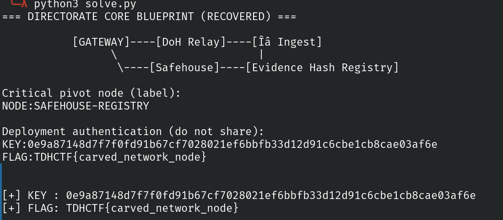

**Findings**
```
Key - 0e9a87148d7f7f0fd91b67cf7028021ef6bbfb33d12d91c6cbe1cb8cae03af6e
Flag - TDHCTF{carved_network_node}
```


## Challenge 17: Net 01 Onion PCAP

**Category:**
Network Forensics

**Difficulty:**
Easy

**Method:**
PCAP Analysis, Protocol Header Inspection,Wireshark, Base64 (URL-safe) decoding (CyberChef)

**Description:**
A network capture from the **Royal Mint internal network** shows suspicious activity.  
A rogue engineer is **exfiltrating data over DNS tunneling**, hiding information inside **DNS query names** (subdomain labels).Our goal is to recover both the **KEY** and the **FLAG** from the PCAP.

**Technical Walkthrough**

- Step 1 — Open PCAP & Identify Suspicious DNS Activity
    1. Open the file in Wireshark:
        - `File → Open → net-01-onion-pcap.pcap`
    2. Since the description hinted at DNS tunneling, filter DNS traffic:
        ```wireshark
        dns
        ```
    3. To reduce noise, focus only on DNS queries that have no response (typical tunneling/exfil behavior):    
    ```wireshark
    dns && dns.flags.response == 0
    ```

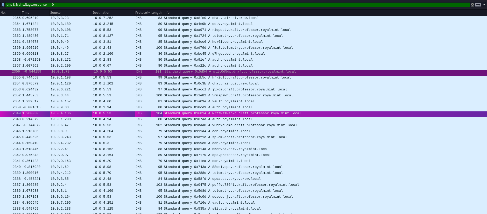

This confirms DNS queries with unusual/random subdomains mixed with normal internal queries.

- Step 2 — Find the Themed Domain (Exfiltration Channel)
            The description said: “Look for DNS queries matching a themed domain hint.”
            While browsing the DNS queries, a suspicious repeated domain appeared:
            ```blueprint.professor.royalmint.local
            ``` 
            Apply a filter to isolate it:
            ```wireshark
            dns.qry.name contains "blueprint"
            ```

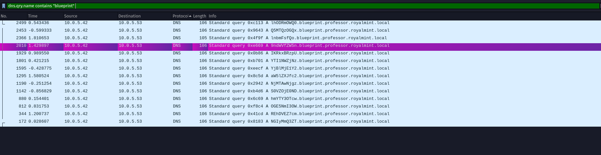

This cleanly isolates repeated DNS queries from the same source host.

- Step 3 — Confirm Source Host & Extract Only Payload Queries
       - From the filtered results:
           - Source client: 10.0.5.42
           - DNS server: 10.0.5.53
           - Query format looked like:
            ```lua
            <chunk>.blueprint.professor.royalmint.local
            ```
To extract only this traffic precisely:

```wireshark
dns && dns.flags.response == 0 && dns.qry.name contains "blueprint.professor.royalmint.local"
```

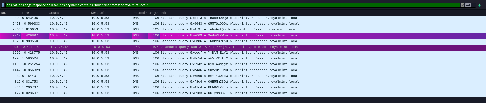

- Step 4 — Reconstruct the Exfiltrated Payload
    - Each DNS query contains a single chunk in the first label (subdomain part)

- Extraction Method (Wireshark)
    - Right click one of the DNS packets → Follow (or export packet details)
    - Copy only the first label of each query (everything before the first dot .)
    - Sort packets by time and concatenate chunks in order

- Step 5 — Decode the Base64 URL-safe Payload

The challenge notes mention Base64 URL-safe encoding, so decode using:
* CyberChef: From Base64 (URL Safe)

**Findings**
```
Key - 144491438d1b0e215ccc1006834b22d7e8fa67970a255fc79a84f9d48a96b79b
Flag - TDHCTF{rogue_engineer_signal}
```


## Challenge 18: Net 02 Doh Rhythm

**Category:**
Network Forensics

**Difficulty:**
Medium

**Method:**
PCAP Analysis, Protocol Header Inspection, Wireshark, Base64 decoding (Python)

**Description:**
The challenge involved analyzing a network capture file named net-02-doh-rhythm.pcap . The objective was to investigate suspicious HTTP traffic originating from an internal host and identify the method used to exfiltrate sensitive data.

**Step 1 — Identify HTTP Requests**
Open the capture in Wireshark and display all HTTP requests:

```wireshark
http.request
```

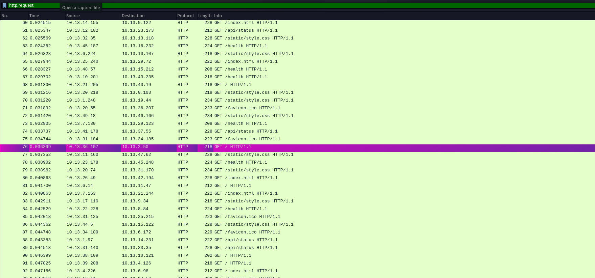

This shows many standard GET requests such as /, /index.html, /api/status, /health, etc.

- Step 2 — Find the Suspicious Client (Beacon Source)
    - To narrow traffic down, we looked for repeated request patterns coming from a single host.
    - In the capture, one internal client repeatedly communicates with a server:
        - Client IP: 10.13.37.10
        - Server IP: 10.13.37.80
        - Repeating endpoints: /api/health, /api/status, /api/metrics

Filter applied:
```wireshark
ip.src == 10.13.37.10 && http.request
```
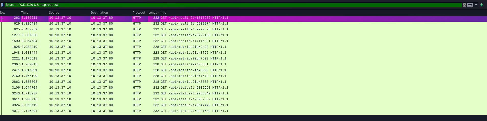

The request rhythm strongly suggests automated beaconing.

- Step 3 — Locate Exfiltration via HTTP Headers
    - The description hints that data is encoded in HTTP request headers.
    - A key indicator found inside the capture was a suspicious User-Agent containing:

```
ExfilChunk-
```

Wireshark filter:
```wireshark
http.user_agent contains "ExfilChunk-"
```

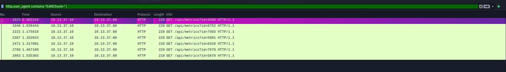

This reveals multiple HTTP requests where the User-Agent field contains Base64-looking fragments.

- Step 4 — Extract the Exfil Chunks
    - Each matching request carried a chunk in the User-Agent header:
    - Example format:
        ```css
        User-Agent: Mozilla/5.0 (compatible; ExfilChunk-<BASE64_PART>)
        ```

- Steps:
    1. Inspect each packet details:
        * Hypertext Transfer Protocol
        * User-Agent: ... ExfilChunk-...
    2. Copy the chunk after ExfilChunk-
    3. Keep chunks in chronological order
    4. Concatenate them into one string

Extracted chunks (in order):
```
S0VZOjVmYjRkNGZlNWUw
MThhMDExZjA4NWQxNTcy
MmE1MmJlNzkxMzY4NDlm
OTc0ZmJkMjE3MWI3OGRl
MjdmMWViZTQKRkxBRzpU
REhDVEZ7ZG5zX3R1bm5l
bF9rZXl9Cg
```

- Step 5 — Decode Base64 to Recover KEY + FLAG

In this challenge I wrote a python script to decode it

Python
```python
import base64

chunks = [
    "S0VZOjVmYjRkNGZlNWUw",
    "MThhMDExZjA4NWQxNTcy",
    "MmE1MmJlNzkxMzY4NDlm",
    "OTc0ZmJkMjE3MWI3OGRl",
    "MjdmMWViZTQKRkxBRzpU",
    "REhDVEZ7ZG5zX3R1bm5l",
    "bF9rZXl9Cg"
]

payload = "".join(chunks)

payload += "=" * (-len(payload) % 4)

decoded = base64.b64decode(payload).decode()
print(decoded)
```

**Findings**
```
Key - 5fb4d4fe5e018a011f085d15722a52be79136849f974fbd2171b78de27f1ebe4
Flag - TDHCTF{dns_tunnel_key}
```


## Challenge 19: Mob 01

**Category:** 
Mobile Forensics

**Difficulty:**
Easy

**Method:** 
Decompilation, String Analysis (strings, grep)

**Description:**
The challenge involved investigating an Android application package named mob-01.apk . The objective was to extract sensitive information (Flag and Key) hidden within the compiled bytecode of the application without running it.

**Technical Walkthrough**
1. Decompression
    - An APK file is essentially a ZIP archive. I started by unzipping the mob-01.apk file into a directory named mob01 to access its internal structure.
    - Command: 
    ```
    unzip mob-01.apk -d mob01
    ````

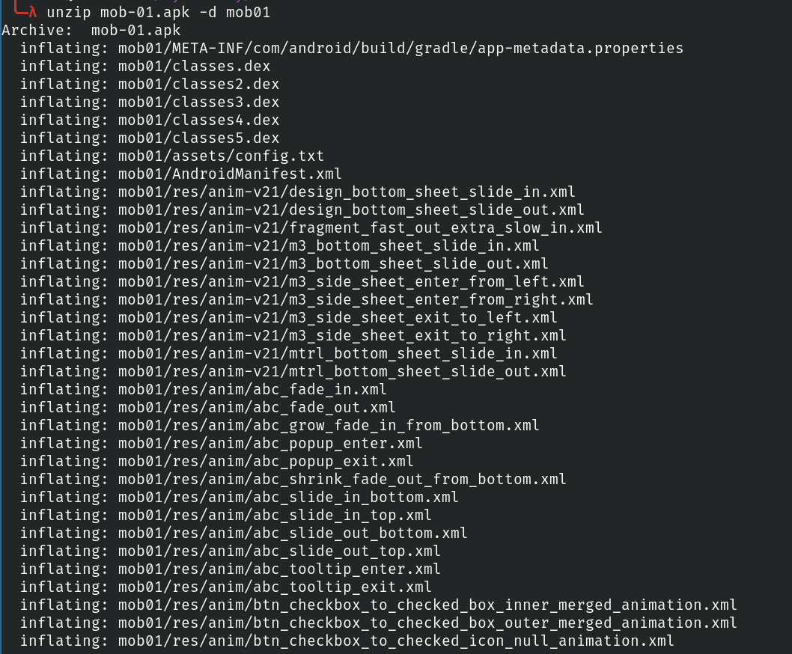

   - The extraction revealed multiple .dex (Dalvik Executable) files (e.g.,classes.dex , classes2.dex ... classes5.dex ), which contain the compiled Java code.

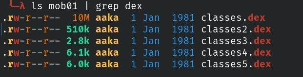

2. String Analysis (Flag Discovery)
    - Instead of using a heavy decompiler like jadx immediately, I performed a quick static analysis using the strings command combined with grep to search for known patterns.
    - I searched for the flag format TDHCTF within the classes5.dex file.
    - Command: 
    ```
    strings mob01/classes*.dex | grep -oE "TDHCTF\{.*\}"
    ```

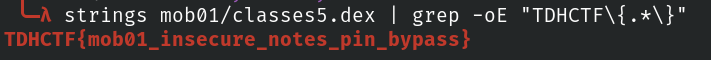

3. Key Extraction
    - The challenge also required finding a 64-character hexadecimal key. I used grep with a regular expression to scan all DEX files for strings matching this specific pattern ([a-f0-9]{64}).
    - Command: 
    ```
    grep -RaoE '\b[a-f0-9]{64}\b' mob01/classes*.dex | head
    ```

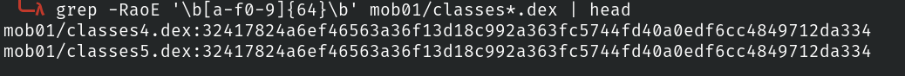

**Findings**
```
Key - 32417824a6ef46563a36f13d18c992a363fc5744fd40a0edf6cc4849712da334
Flag - TDHCTF{mob01_insecure_notes_pin_bypass}
```


## Challenge 20: Mob 02

**Category:** 
Mobile Forensics / Static Analysis

**Difficulty:**
Medium

**Method:** 
Decompilation, String Analysis, Regex Searching

**Description:**
The challenge involved investigating a second Android application package named mob-02.apk . Similar to the previous mobile challenge, the objective was to perform static analysis to recover the hidden flag and a secure cryptographic key embedded within the compiled bytecode.

**Technical Walkthrough**
1. Decompression & Enumeration
    - I began by unzipping the mob-02.apk archive into a dedicated directory(mob02) to inspect its contents.
    - Command: 
    ```
    unzip mob-02.apk -d mob02 .
    ```

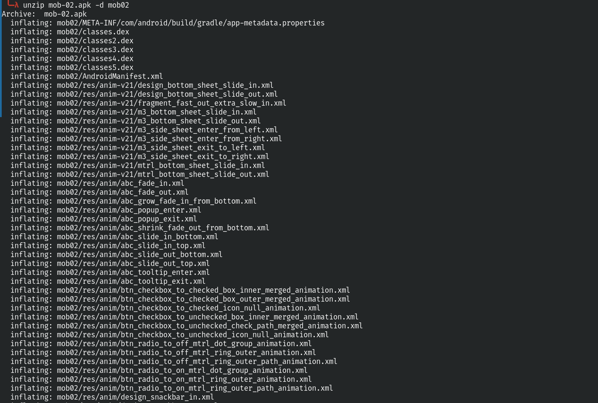

   - Listing the files revealed multiple Dalvik Executable ( .dex ) files, ranging from classes.dex to classes5.dex .

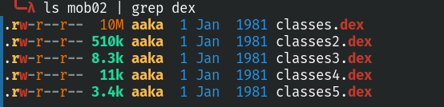

2. Flag Discovery
    - I used the strings utility to search for the known flag format ( TDHCTF ) within the bytecode files.
    - Command: 
    ```
    strings mob02/classes*.dex | grep -oE "TDHCTF\{.*\}" .
    ```

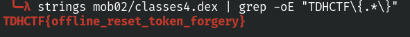

3. Key Extraction
    - To locate the 64-character hexadecimal key, I utilized grep with a regular expression ( \b[a-f0-9]{64}\b ) to recursively scan all .dex files in the directory.
    - Command: 
    ```
    grep -RaoE '\b[a-f0-9]{64}\b' mob02/classes*.dex | sort -u .
    ```

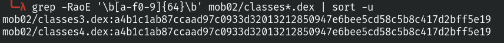

**Findings**
```
Key - a4b1c1ab87ccaad97c0933d32013212850947e6bee5cd58c5b8c417d2bff5e19
Flag - TDHCTF{offline_reset_token_forgery}
```


# ------------------------------------ FINISH --------------------------------------- #